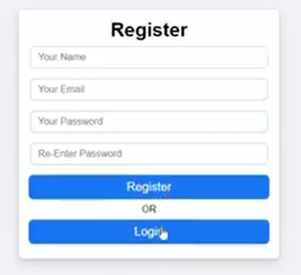

<h1 align="center">Nodejs-LoginRegister</h1>
<a href="#">
  

    
  

</a>

## What I have learnt:
- [x] Express Framework.
- [x] MongoDB Database.
- [x] Mongoose.
- [x] Cors.
- [x] HTML, CSS and React

## What This App does:
- [x] Used MongoDB database for this project.
- [x] Used Mongoose to connect with MongoDB.
- [x] Used Express Framework and worked on Post Function.
- [x] Developed FrontEnd using HTML, CSS and React.

## Author
You can get in touch with me on my LinkedIn Profile:

#### Hira Shahid

You can also follow my GitHub Profile to stay updated about my latest projects: 

If you liked the repo then kindly support it by giving it a star ⭐!

## LICENSE
- MIT (2021)
